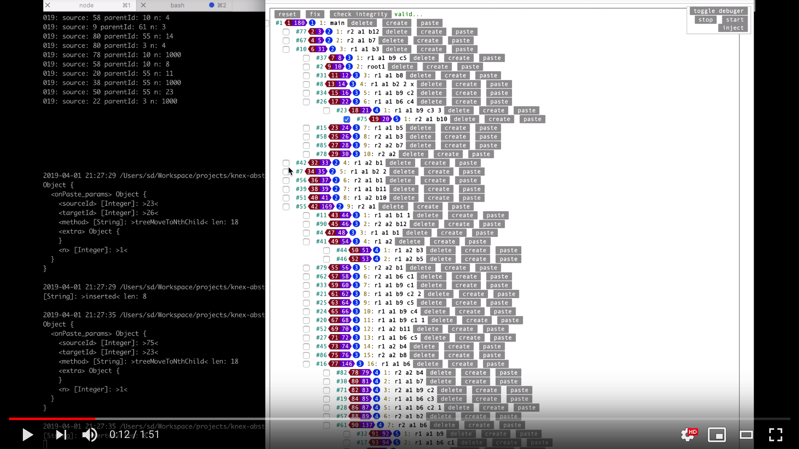

[](https://travis-ci.org/stopsopa/knex-abstract)
[](https://badge.fury.io/js/knex-abstract)
[](https://codecov.io/gh/stopsopa/knex-abstract/tree/v0.0.82)
[](https://github.com/knex-abstract/blob/master/LICENSE)


[](https://youtu.be/d8k98noOR5c)


# Installation:

    npx knex-abstract
    cd knex-project
    cat test.js
    # and see Makefile
    
# usege: 

    require('dotenv-up')(4, false, '.env');
    
    const knex              = require('knex-abstract');
    
    const config      = require('config');
    
    knex.init(config);
    
    (async function(){
    
        const list = await knex().model.common.raw('show tables');
        
        // ...
    
        
    })();
    
# examples:
    
- [transactions](migrations/src/migration/1545125154513-auto.ts)

See example of [config](models/config.js)

Follow:

 - [test cases](https://github.com/stopsopa/knex-abstract/blob/master/test/knex/mysql/mysql-insert.test.js)
 - [test script](https://github.com/stopsopa/knex-abstract/blob/master/example/test.js)
 
# Nested set

```javascript

// tags.js
const abstract          = require('knex-abstract');

const extend            = abstract.extend;

const prototype         = abstract.prototype;

const a                 = prototype.a;

const nestedset         = require('knex-abstract/nestedset');

const table             = 'tags';

const id                = 'id';

module.exports = knex => extend(knex, prototype, Object.assign(nestedset({
    columns: {
        l       : 'l',
        r       : 'r',
        level   : 'level',
        pid     : 'parent_id',
        sort    : 'sort',
    }
}), {
    initialize: () => {} // other custom methods
}), table, id);

``` 

And from now on manager will have extra available methods:

```javascript

const knex          = require('knex-abstract');

(async function () {
    

    const man = knex().model.tags;
        
    // this method will initialize columns level, sort, l, r
    // and if root already exist this method will check if it's valid
    const root = await man.treeInit({ 
        title: 'root'
    });
    
    // will find element with only id, parent_id, level, sort, l, r columns
    // columns will be normalized to regular names pid, level, sort, l, r even if real columns in 
    // database are different
    const node = await man.treeFindOne();
    
    // ... and others
    
    
    
        
    
})()

```

# Dev notes

```bash

git clone https://github.com/stopsopa/knex-abstract.git 
cd knex-abstract
make doc
sleep 10 # give little time for mysql docker to start
make ct
cp .env.dist .env
cp migrations/ormconfig.js.dist migrations/ormconfig.js
yarn
npm install --global nodemon
make link
make fixtures
make manual


```

.. and simply visit http://localhost:8080/
